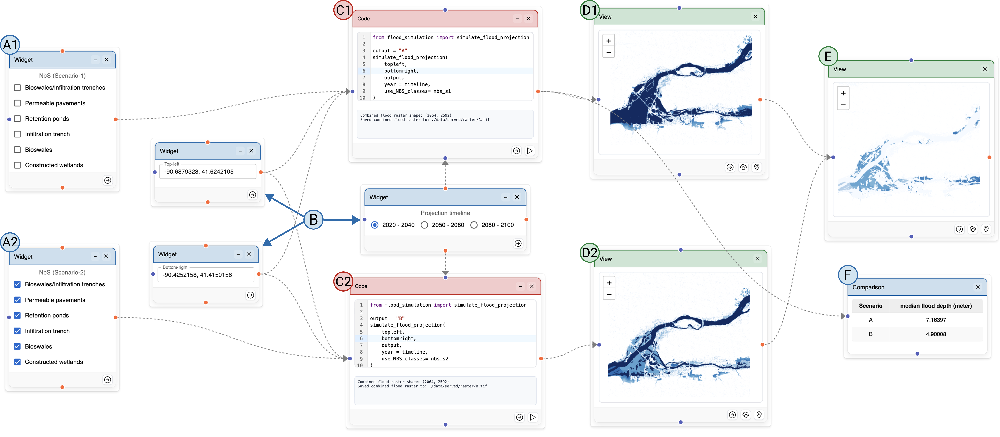

# SCOUT: An Open-Access Scenario-Oriented Urban Toolkit for Decision Support

SCOUT is a decision-support toolkit shaped by requirements from experts across multiple urban domains that operationalizes a decision-making framework through a dataflow model for combining urban data and models and a scenario-oriented visualization grammar that treats decision alternatives and outcomes as first-class objects



<div align="center">
    <b>Creating a dataflow with SCOUT to explore flood projections.</b>
</div>

## Installation Guide

To setup SCOUT:

- Follow this [guide](https://docs.anaconda.com/free/anaconda/install/index.html) to install Anaconda.
- Follow this [link](https://nodejs.org/en/download/) to install Node. Prebuilt binaries/installer is the easiest way to perform installation.

## Data and Models

We added data and models for the three case studies showcased in the paper **"backend/data"** and **"backend/models"** folder to illustrate the usage of the system.

<!-- This short [video]() illustrates how to run the application and generate visualizations. -->

<TODO- Heading- Data Formats. For GRF JNT STEP. Add SS of csvs.>

## Project Setup

Clone the repository or download a zipped version of SCOUT from this page.

Run the following command in the terminal to install the necessary dependencies for the client side setup.

```bash
# Navigate to the frontend directory
cd frontend

# Install the necessary client side dependencies.
npm install
```

Now, run the following commands in the terminal to install the necessary dependencies for the **server** side, specifically for running the three case studies showcased in SCOUT.

```bash
# Navigate to the backend directory
cd backend

# Create a new conda in-folder environment
conda create --prefix ./envs python=3.9.23
conda config --set env_prompt '({name})'

# Activate the conda environment
conda activate ./envs

# Installing required dependencies
conda install -c conda-forge dask-core=2023.4.0 datashader=0.14.4 flask=2.2.3 geopandas=0.12.2 ipykernel=6.19.2 matplotlib=3.7.1 numpy=1.23.5 pandas=2.0.0 python=3.9.16 pygeos=0.14 flask-cors=6.0.1 geopy=2.4.1 osmnx=1.9.4 pyrosm=0.6.2 osmium-tool=1.16.0

# pip dependencies
pip install spatialpandas==0.4.7 opencv-python==4.7.0.72 pyarrow==11.0.0 osmium==3.6.0
```

## Run the application

Open a terminal inside the SCOUT folder. Run the following commands in the terminal:

```bash
# Navigate to the backend directory
cd backend

# Activate the conda environment
conda activate ./envs

# Start the server
python server.py
```

Open another terminal inside the SCOUT folder. Run the following commands in the terminal:

```bash
# Navigate to the frontend directory
cd frontend

# Start the web application
npm start
```
