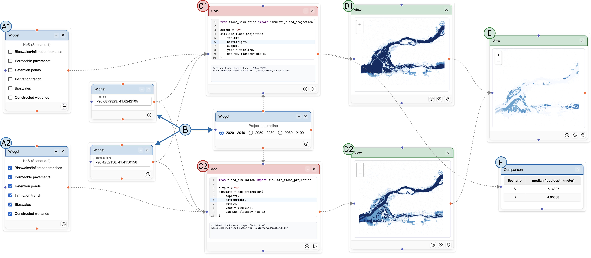

# SCOUT: An Open-Access Scenario-Oriented Urban Toolkit for Decision Support

SCOUT is a decision-support toolkit shaped by requirements from experts across multiple urban domains that operationalizes a decision-making framework through a dataflow model for combining urban data and models and a scenario-oriented visualization grammar that treats decision alternatives and outcomes as first-class objects



<div align="center">
    <b>Creating a dataflow with SCOUT to explore flood projections.</b>
</div>

## Access the Toolkit Online

Go to: [https://arcade.evl.uic.edu/scout/](https://arcade.evl.uic.edu/scout/)

## Running Locally with Docker

Follow the steps below to set up and run the project locally.

### 1. Install Docker

- Download and install Docker Desktop:
  - https://www.docker.com/products/docker-desktop
- Verify installation:

```bash
docker --version
docker-compose --version
```

### 2. Clone the Repository

```bash
git clone <your-repo-url>
cd <your-project-folder>
```

### 3. Build the Containers

```bash
docker-compose --file docker-compose.dev.yml build --no-cache
```

- Builds all services defined in docker-compose.dev.yml
- --no-cache ensures a fresh build without using cached layers

### 4. Start the Containers

```bash
docker-compose --file docker-compose.dev.yml up --remove-orphans
```

- Starts all services
- --remove-orphans removes containers not defined in the compose file
