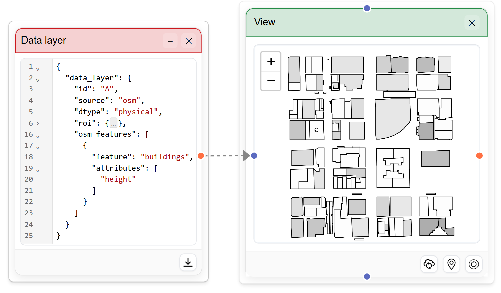
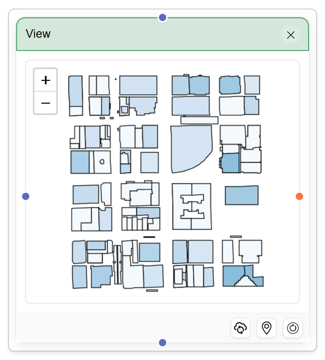
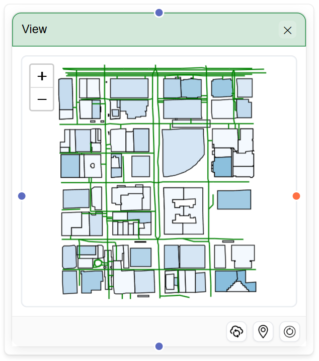
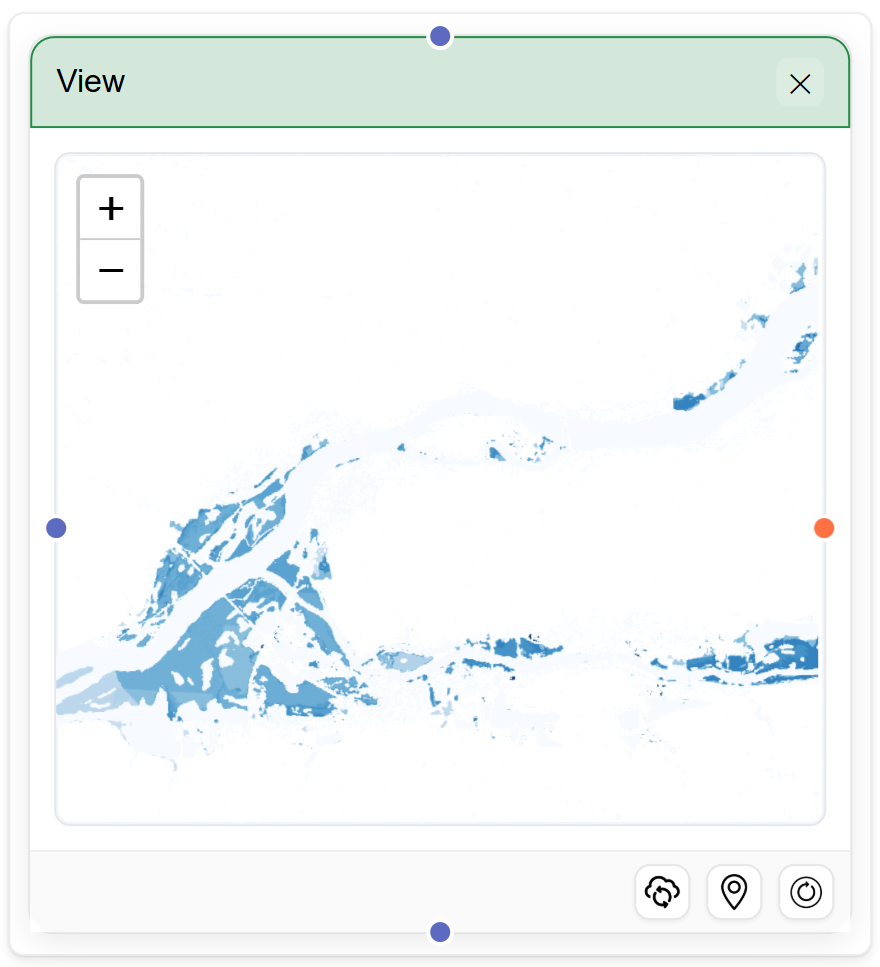
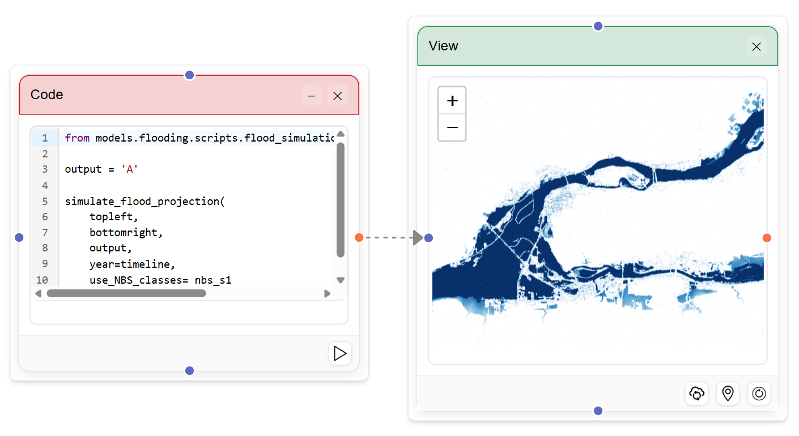
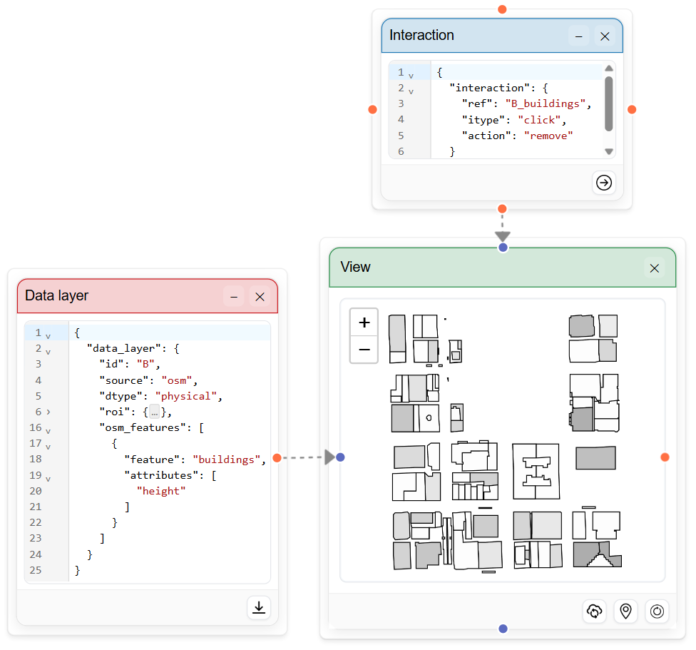
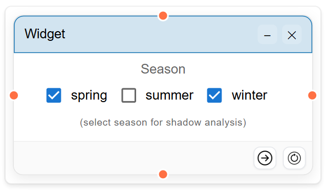
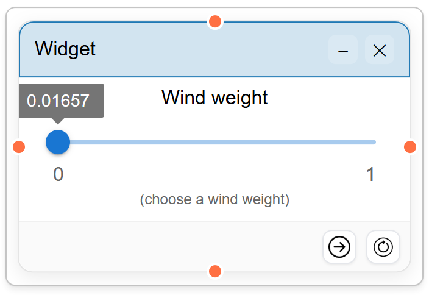
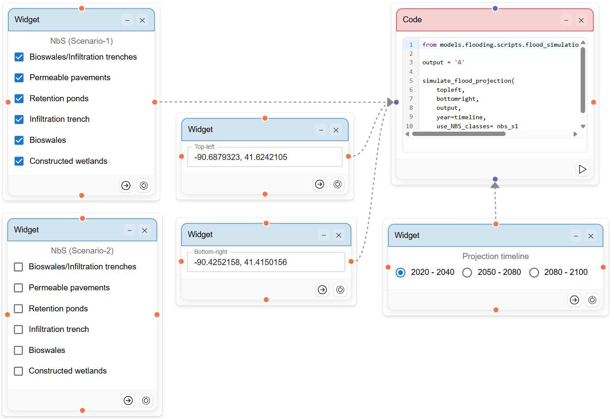

# SCOUT Components and Usage

This page describes the core grammar components used in **SCOUT** and how they connect to each other through dataflows. We also provide concrete usage examples that are replicable using the toolkit. The grammar is organized into three groups:

- **Intelligence**: `data_layer`, `join`
- **Design**: `view`
- **Choice**: `interaction`, `widget`, `comparison`

---

## `data_layer`

A `data_layer` represents an urban dataset or model output that other nodes can render, transform, or interact with.

#### Structure

```txt
data_layer := (id, source, feature, roi, attributes?)
```

#### Fields

- `id`: Unique id of the data layer that downstream nodes can reference.
- `source`: Where the data comes from, such as OpenStreetMap or a local file.
- `feature`: Type of data layer such as `buildings`, `streets`, `parks`, `water`.
- `roi`: The region of interest.
- `attributes`: Fields to use for each `feature`, such as building height, or road speed.

#### Example

```json
{
  "data_layer": {
    "id": "A",
    "source": "osm",
    "dtype": "physical",
    "roi": {
      "datafile": "chicago",
      "type": "bbox",
      "value": [-87.66, 41.86, -87.64, 41.88]
    },
    "osm_features": [
      {
        "feature": "buildings",
        "attributes": ["height"]
      }
    ]
  }
}
```

#### Usage

<table>
  <tr>
    <td  width="50%">
      A <code>data_layer</code> usually feeds into a <code>view</code> node for visualization, or a <code>join</code> node for transformation. SCOUT supports common geospatial formats such as GeoTIFF, GeoJSON, and Feather; the underlying format is inferred from filename extension, so authors do not need to annotate it in the grammar.
    </td>
    <td width="50%">
      
      <p align="center"><em>Defined data layer feeding to a view node</em></p>
    </td>
  </tr>
</table>

---

## `join`

A `join` combines two data layers and derive a new layer from their relationship.

#### Structure

```txt
join := (id, ref_left, ref_right, op, aggr)
```

#### Fields

- `id`: Name of the derived output from join operation.
- `ref_left`: Reference to the first input layer.
- `ref_right`: Reference to the second input layer.
- `op`: The relationship between the two layers, such as `intersects`, `contains`, `within`, `nearest`, or `overlaps`.
- `aggr`: How matched values are summarized, such as `count`, `sum`, `mean`, `min`, or `max`.

#### Example

```json
{
  "join": {
    "id": "A_buildings_mean_flood_depth",
    "ref_left": "A_buildings",
    "ref_right": "flood_depth",
    "op": "contains",
    "aggr": "mean"
  }
}
```

#### Usage

The output of a `join` can be rendered in a `view`, or sent into a `computation node`. For example, average flood depth that intersects per building's footprint can be visualized in a `view` or sent to a `computation node` for modeling purposes.

---

## `view`

A `view` defines how SCOUT renders data layers (either defined or derived).

- _Defined layers_ are created through `data_layer`.
- _Derived layers_ are produced through operations such as `join`, or as scenario outputs from `computation node`.
- A `view` can show a single layer, overlay multiple layers, or compare two scenarios such as baseline versus intervention.

#### Structure

```txt
view := (ref, style?)+ | (ref_base, ref_comp, style?)
```

#### Fields

- `ref`: Reference to a `data_layer` or a derived output to render.
- `ref_base`: Reference to the baseline scenario layer.
- `ref_comp`: Reference to the intervention scenario layer.
- `style`: Visual encoding properties such as fill, stroke, opacity, color scale, line width.

#### Single-layer example

<table>
  <tr>
    <td  width="50%">
      <pre><code>{
  "view": [
    {
      "ref": "A_buildings",
      "style": {
        "fill": {
          "feature": "height",
          "range": [0, 550],
          "colormap": "blues"
        },
        "stroke-color": "#333333",
        "opacity": 1
      }
    }
  ]
}</code></pre>
    </td>
    <td  width="50%">
    <p align="center"><em>Visualizing a single layer (i.e., buildings) in a view node</em></p></td>
  </tr>
</table>

#### Multi-layer example

<table>
  <tr>
    <td  width="50%">
      <pre><code>{
  "view": [
    {
      "ref": "A_buildings",
      "style": {
        "fill": {
          "feature": "height",
          "range": [0, 550],
          "colormap": "blues"
        },
        "stroke-color": "#333333",
        "opacity": 1
      }
    },
    {
      "ref": "A_roads",
      "style": {
        "stroke": {
          "color": "green",
          "width": 1.5
        },
        "opacity": 1
      }
    }
  ]
}
</code></pre>
    </td>
    <td  width="50%">
    <p align="center"><em>Visualizing multiple layers (i.e., buildings and roads) in a view node</em></p></td>
  </tr>
</table>

#### Compare two scenarios example

<table>
  <tr>
    <td  width="50%">
      <pre><code>{
  "view": [
    {
      "ref_base": "B",
      "ref_comp": "A",
      "style": {
        "opacity": 1,
        "colormap": "blues"
      }
    }
  ]
}
</code></pre>
    </td>
    <td  width="50%">
    <p align="center"><em>Difference map comparing flooding scenario A vs B</em></p></td>
    
  </tr>
</table>

#### Usage

<table>
  <tr>
    <td  width="50%">
      A <code>view</code> can consume and visualize outputs from <code>Intelligence</code> nodes (i.e., defined or derived data layers). Or, it can also visualize derived scenario outputs from the <code>computation</code> node (e.g., model/<code>computation</code> node generates projection of a flooding scenario, and a view node is used to visualize the this scenario).
    </td>
    <td width="50%">
      
      <p align="center"><em>Computation node feeding a flooding scenario to a view node</em></p>
    </td>
  </tr>
</table>

---

## `Interaction`

An `interaction` defines how users directly manipulate a `data_layer` through `view`. Interactions are useful when scenario alternatives depend on geometry edits, feature selection, or attribute changes.

#### Structure

```txt
interaction := (ref, itype, action, attribute?, condition?)
```

#### Fields

- `ref`: Reference to the `data_layer` being manipulated.
- `itype`: The trigger, such as `click`, `draw`, `drag`, `select`, or `brush`.
- `action`: `add`/`remove`/`modify`/`highlight`. The operation performed after the trigger, such as `add` or `remove` an instance of the `data_layer`, or `update` an `attribute` of an instance.
- `attribute`: The field being changed when `interaction` modifies that field for a data instance.
- `condition`: Optional condition that limits when the interaction is applied for a group of data instances. e.g., _building height_ _>= 50m_.

#### Example

```json
{
  "interaction": {
    "ref": "A_buildings",
    "itype": "click",
    "action": "remove"
  }
}
```

#### Usage

<table>
  <tr>
    <td  width="50%">
      An <code>interaction</code> typically connects to a <code>view</code> node allowing to make changes to referenced <code>data_layer</code> in that <code>view</code>.
    </td>
    <td width="50%">
      
      <p align="center"><em>Interaction node allowing to remove buildings upon clicking them</em></p>
    </td>
  </tr>
</table>

---

## Widget

A `widget` exposes a model or scenario parameter as a user-facing control. Widgets help technical authors turn complex dataflow pipelines into dashboards that non-technical users can operate.

#### Structure

```txt
widget := (wtype, variable, choices?, default?, props?)
```

#### Fields

- `wtype`: The control type, such as `radio`, `checkbox`, `dropdown`, `slider`, `number_input`, or `location_input`.
- `variable`: The model parameter controlled by the widget.
- `choices`: Available options for discrete or stepped inputs.
- `default`: The initial value.
- `props`: Display and validation options, such as label, units, min, max, or step.

#### Example

<table>
  <tr>
    <td  width="50%">
      <pre><code>{
  "widget": {
    "wtype": "checkbox",
    "variable": "season",
    "choices": [
      "spring",
      "summer",
      "winter"
    ],
    "default": [
      "spring",
      "winter"
    ],
    "props": {
      "title": "Season",
      "mode": "group",
      "description": "(select season for shadow analysis)",
      "orientation": "horizontal"
    }
  }
}
</code></pre>
    </td>
    <td  width="50%">
    <p align="center"><em>Checkbox input control created through the grammar spec</em></p></td>
  </tr>
</table>

<table>
  <tr>
    <td  width="50%">
      <pre><code>{
  "widget": {
    "wtype": "slider",
    "variable": "wind",
    "default": 0.01657,
    "props": {
      "title": "Wind weight",
      "description": "(choose a wind weight)",
      "min": 0,
      "max": 1,
      "step": 0.00001,
      "orientation": "horizontal"
    }
  }
}
</code></pre>
    </td>
    <td  width="50%">
    <p align="center"><em>Slider input control created through the grammar spec</em></p></td>
  </tr>
</table>

### Usage

<table>
  <tr>
    <td  width="50%">
      <code>Widget</code> values feed into <code>computation</code>/model nodes. When a user selects a different value through the <code>widget</code>, SCOUT can rerun the relevant part of the pipeline and update <code>view</code> and <code>comparison</code> nodes accordingly.
    </td>
    <td width="50%">
      
      <p align="center"><em>Multiple widgets feeding parameter values to a computation node</em></p>
    </td>
  </tr>
</table>

## Comparison

A `comparison` defines how SCOUT summarizes differences across scenarios.

Comparisons make trade-offs visible by turning scenario outputs into charts, tables, or metrics that can support decisions.

### Structure

```txt
comparison := (x*, y*, key+, chart, props?)
```

### Fields

- `x`: The independent dimension, such as timeline, scenario, neighborhood, or intervention type.
- `y`: The measured outcome, such as average flood depth, shadow duration, travel time, or exposed population.
- `key`: Grouping fields used for comparison.
- `chart`: The representation, such as `bar`, `line`, `table`, `pie`, or `scatter`.
- `props`: Display options such as title, units, sorting, labels, or aggregation.

### Example

```txt
comparison(
  x: projection_timeline,
  y: avg_flood_depth,
  key: [scenario],
  chart: line,
  props: { title: "Projected flood depth by scenario", unit: "m" }
)
```

```txt
comparison(
  x: scenario,
  y: mean_shadow_duration,
  key: [park_area],
  chart: bar,
  props: { title: "Sunlight access comparison", unit: "hours" }
)
```

```txt
comparison(
  x: intervention,
  y: exposed_buildings,
  key: [neighborhood],
  chart: table
)
```

### Usage

A `comparison` usually sits downstream of model outputs, joined layers, or scenario views. It helps users decide which scenario performs better under the criteria they care about.
