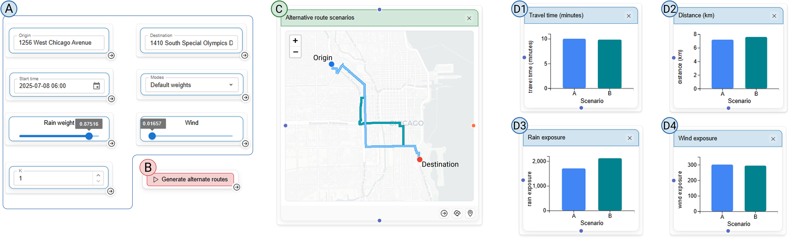

# Weather-aware route planning

This use case demonstrates how SCOUT supports transportation scenario planning under dynamic weather conditions by comparing alternative routes. It begins by integrating a weather-aware routing model through a `computation` node, with key parameters—such as origin, destination, travel time, number of routes, and tolerance to weather factors—exposed via `widget` nodes. These inputs define different routing scenarios by allowing users to prioritize or trade off factors such as rain, wind, and travel time. The model generates multiple candidate routes for each scenario, which are visualized in a map-based `view` node. Additional `comparison` nodes summarize route characteristics, including travel time, distance, and accumulated exposure to weather conditions. Users can iteratively adjust `widget` parameters and rerun the model, with updated routes and metrics reflected across the `view` and `comparison` nodes, enabling direct comparison of alternative transportation scenarios under evolving weather conditions.

### Open in live application

[Live use case](https://arcade.evl.uic.edu/scout/routing)
