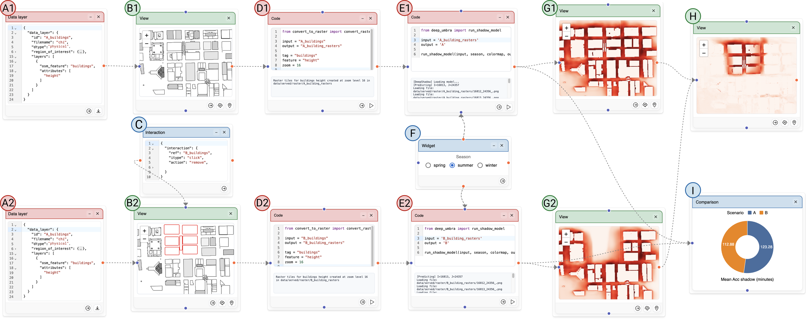

# Evaluating alternative high-rise configurations

This use case demonstrates how SCOUT supports comparing two alternative building configuration scenarios considering sunlight access. It begins by defining building data using a `data_layer` node, which is then visualized through a `view` node. Users create a parallel scenario by defining a second set of `data_layer` and `view` nodes, and simulate an alternative by removing selected buildings through an `interaction` node connected to the `view`. For each scenario, the a shadow model is executed through `computation` nodes, parameterized by a season `widget`. The resulting shadow maps for the baseline and alternative scenarios and their difference are visualized in separate `view` nodes, while the mean accumulated shadow (in minutes) is compared across the two scenarios using a `comparison` node.

### Open in live application

[Live use case](https://arcade.evl.uic.edu/scout/shadow)
